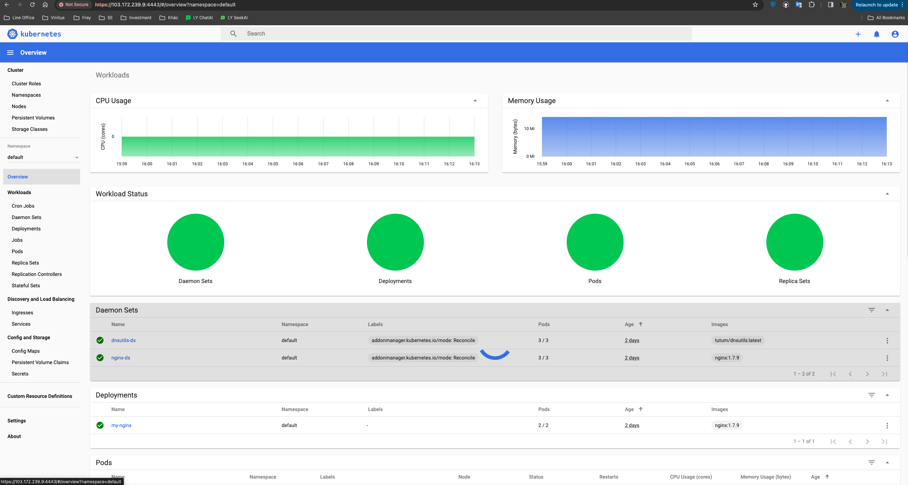

tags: addons, dashboard

# 08-3. Deploy dashboard plug-in

<!-- TOC -->

- [08-3. Deploy dashboard plug-in](#08-3-Deployment-dashboard-plug-in)
     - [Download and modify configuration files](#Download and modify configuration files)
     - [Execute all definition files](#Execute all definition files)
     - [View running status](#View running status)
     - [visit dashboard](#visit-dashboard)
         - [Access dashboard through port forward](#Access-dashboard through-port-forward-)
     - [Create token and kubeconfig configuration file for logging in to Dashboard](#Create token-and-kubeconfig-config file for login-dashboard-)
         - [Create login token](#create login-token)
         - [Create a KubeConfig file using token](#Create a -kubeconfig-file using -token-)
     - [reference](#reference)

<!-- /TOC -->

Unless otherwise specified, all operations in this document are performed on the idc-k8s-01 node;

## Download and modify configuration files

``` bash
cd /opt/k8s/work
wget https://raw.githubusercontent.com/kubernetes/dashboard/v2.0.0-rc4/aio/deploy/recommended.yaml
mv  recommended.yaml dashboard-recommended.yaml
```

## Execute all definition files

``` bash
cd /opt/k8s/work
kubectl apply -f  dashboard-recommended.yaml
```

## Check the running status

``` bash
$ kubectl get pods -n kubernetes-dashboard 
NAME                                         READY   STATUS    RESTARTS   AGE   IP              NODE         NOMINATED NODE   READINESS GATES
dashboard-metrics-scraper-7b8b58dc8b-m74cf   1/1     Running   0          38s   172.30.140.68   idc-k8s-02   <none>           <none>
kubernetes-dashboard-6cfc8c4c9-44vdk         1/1     Running   0          38s   172.30.73.69    idc-k8s-03   <none>           <none>
```

## Access dashboard

Starting from 1.7, the dashboard only allows access through https. If using kube proxy, it must listen on localhost or 127.0.0.1. There is no such restriction for NodePort, but it is only recommended for use in development environments. For login access that does not meet these conditions, the browser will not jump after successful login and will always stop at the login interface**.

### Access dashboard through port forward

Start port forwarding:

``` bash
[root@idc-k8s-01 work] kubectl port-forward -n kubernetes-dashboard  svc/kubernetes-dashboard 4443:443 --address 0.0.0.0
```

Browser access URL: `https://103.172.239.9:4443`


## Create token and kubeconfig configuration file for logging in to Dashboard

The dashboard only supports token authentication by default (client certificate authentication is not supported), so if you use the Kubeconfig file, you need to write the token to the file.

### Create login token

``` bash
kubectl create sa dashboard-admin -n kube-system
kubectl create clusterrolebinding dashboard-admin --clusterrole=cluster-admin --serviceaccount=kube-system:dashboard-admin
ADMIN_SECRET=$(kubectl get secrets -n kube-system | grep dashboard-admin | awk '{print $1}')
DASHBOARD_LOGIN_TOKEN=$(kubectl describe secret -n kube-system ${ADMIN_SECRET} | grep -E '^token' | awk '{print $2}')
echo ${DASHBOARD_LOGIN_TOKEN}
```

Use the output token to log in to Dashboard.

### Create a KubeConfig file using token

``` bash
source /opt/k8s/bin/environment.sh
# 设置集群参数
kubectl config set-cluster kubernetes \
  --certificate-authority=/etc/kubernetes/cert/ca.pem \
  --embed-certs=true \
  --server=${KUBE_APISERVER} \
  --kubeconfig=dashboard.kubeconfig

# 设置客户端认证参数，使用上面创建的 Token
kubectl config set-credentials dashboard_user \
  --token=${DASHBOARD_LOGIN_TOKEN} \
  --kubeconfig=dashboard.kubeconfig

# 设置上下文参数
kubectl config set-context default \
  --cluster=kubernetes \
  --user=dashboard_user \
  --kubeconfig=dashboard.kubeconfig

# 设置默认上下文
kubectl config use-context default --kubeconfig=dashboard.kubeconfig
```

Log in to the Dashboard using the generated dashboard.kubeconfig.



## Reference

1. https://github.com/kubernetes/dashboard/wiki/Access-control
2. https://github.com/kubernetes/dashboard/issues/2558
3. https://kubernetes.io/docs/concepts/configuration/organize-cluster-access-kubeconfig/
4. https://github.com/kubernetes/dashboard/wiki/Accessing-Dashboard---1.7.X-and-above
5. https://github.com/kubernetes/dashboard/issues/2540
